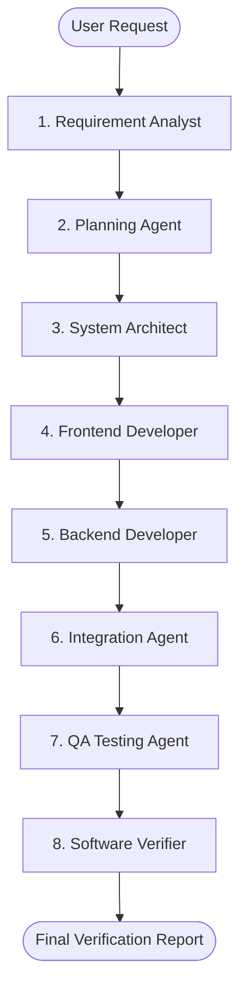

# LangChain Agentic AI Software Development Team (SDLC Framework)

This project is a multi-agent software engineering framework designed to orchestrate specialized AI agents through a complete Software Development Life Cycle (SDLC). The system utilizes LangChain and integrates with both cloud-based and local LLMs to dynamically analyze, plan, design, write, integrate, and verify codebase repositories.

> [!IMPORTANT]
> The primary focus of this project is the **Agentic SDLC Framework** ([agent.py](file:///c:/Users/KETAN/Desktop/Agentic%20AI/agent.py)). Any web applications or services in the workspace (such as the calculator or task manager applications inside the `projects/` directory) are validation outputs generated by the agent team to verify filesystem integration and execution reliability.

---

## 📐 Multi-Agent SDLC Architecture

Development tasks are divided into 8 distinct roles executed in a sequential pipeline, mimicking a professional software team:



### The 8 Agent Personas

1. **Requirement Analyst Agent**: Analyzes requests, extracts key features/constraints, identifies assumptions, and compiles improvements. Includes a human-in-the-loop review.
2. **Planning Agent**: Formulates a detailed development task roadmap.
3. **System Architect Agent**: Designs file systems, database schemas, modules, and API layouts.
4. **Frontend Developer Agent**: Autonomously drafts user interfaces, styles, and scripts.
5. **Backend Developer Agent**: Implements backend server paths, APIs, and business logic.
6. **Integration Agent**: Resolves imports, wires frontend pages to backend handlers, and resolves localhost paths.
7. **QA Testing Agent**: Reads the generated files on disk to inspect syntax and confirm code sanity.
8. **Software Verification Agent**: Performs final requirements verification and compiles the final deployment report.

---

## 📂 Repository Structure

* 📄 **[agent.py](file:///c:/Users/KETAN/Desktop/Agentic%20AI/agent.py)**: The main Python CLI application initiating the LangChain multi-agent SDLC workflow.
* 📄 **[requirements.txt](file:///c:/Users/KETAN/Desktop/Agentic%20AI/requirements.txt)**: Python dependencies for running the agent framework.
* 📁 **[myenv](file:///c:/Users/KETAN/Desktop/Agentic%20AI/myenv)**: Pre-configured Python virtual environment containing framework requirements.
* 📁 **[projects](file:///c:/Users/KETAN/Desktop/Agentic%20AI/projects)**: Scoped sandbox directory holding generated applications.
  * 📁 **[calculator](file:///c:/Users/KETAN/Desktop/Agentic%20AI/projects/calculator)**: Neumorphic glassmorphism calculator validation output.
    * 📄 **[app.py](file:///c:/Users/KETAN/Desktop/Agentic%20AI/projects/calculator/app.py)**: Python Flask server exposing backend calculation APIs.
    * 📁 **[templates](file:///c:/Users/KETAN/Desktop/Agentic%20AI/projects/calculator/templates)**: Template directory holding [index.html](file:///c:/Users/KETAN/Desktop/Agentic%20AI/projects/calculator/templates/index.html).
    * 📁 **[static](file:///c:/Users/KETAN/Desktop/Agentic%20AI/projects/calculator/static)**: Static assets folder holding [style.css](file:///c:/Users/KETAN/Desktop/Agentic%20AI/projects/calculator/static/style.css) and [script.js](file:///c:/Users/KETAN/Desktop/Agentic%20AI/projects/calculator/static/script.js).
  * 📁 **[task_manager](file:///c:/Users/KETAN/Desktop/Agentic%20AI/projects/task_manager)**: Basic Outfit-styled task list manager validation output.
    * 📄 **[app.py](file:///c:/Users/KETAN/Desktop/Agentic%20AI/projects/task_manager/app.py)**: Python Flask task manager server running on port `5001`.
    * 📁 **[templates](file:///c:/Users/KETAN/Desktop/Agentic%20AI/projects/task_manager/templates)**: Template directory holding task dashboard [index.html](file:///c:/Users/KETAN/Desktop/Agentic%20AI/projects/task_manager/templates/index.html).

---

## ⚙️ Core Framework Features

### 🤝 Human-in-the-Loop Confirmation
After the **Requirement Analyst** runs, the pipeline pauses. The user can review extracted goals, ask questions, or modify specifications. The framework regenerates requirements based on feedback before proceeding to the planning phase.

### 🌐 Multi-LLM Orchestration & Fallbacks
Different agents can be assigned to different LLMs (Gemini, Groq, or Ollama for local runs) via configuration. If a cloud model experiences rate limits or connection errors, the framework displays an interactive CLI menu allowing the user to switch LLM backends dynamically.

### 📁 Dynamic Project Sandboxing
The framework prompts the user for a project name at startup and automatically scopes all downstream tool writes (`write_file`, `list_files`, etc.) inside a `projects/<project_name>/` sandbox. This protects the framework codebase from being overwritten by agents.

### 🐙 Automated Git Tracking
When a project is created, the framework programmatically runs `git init` inside the project folder and configures a default `.gitignore`. Upon successful completion of the SDLC by the **Software Verifier**, the framework commits the generated application state automatically.

---

## 🚀 Running the Project

### 1. Activate the Virtual Environment
Open a terminal in the root directory and run the activator matching your shell:

**PowerShell:**
```powershell
.\myenv\Scripts\Activate.ps1
```

**Windows Command Prompt:**
```cmd
.\myenv\Scripts\activate.bat
```

### 2. Launch the Agentic Developer Pipeline
Run the multi-agent CLI, enter a project name, and describe what you want the agents to build:
```bash
python agent.py
```

### 3. Run the Validation Output Applications
To test and run the generated validation applications on localhost:

* **Calculator App** (runs on port `5000`):
  ```bash
  python projects/calculator/app.py
  ```
* **Task Manager App** (runs on port `5001`):
  ```bash
  python projects/task_manager/app.py
  ```

---

## 🎯 Current Focus & Roadmap

We are currently refining the framework's execution reliability and flexibility. Active development focuses on:
* **Tool-Use Reliability**: Ensuring development agents consistently use filesystem tools to write real files on disk instead of just outputting markdown code blocks in the terminal.
* **Dynamic Prompts**: Moving away from Flask-specific hardcoded prompts to allow the **System Architect** to select and feed the target stack directly to downstream developer agents.
* **Self-Healing Code Verification**: Improving QA and compiler-driven verification loops to automatically catch and fix execution errors.
